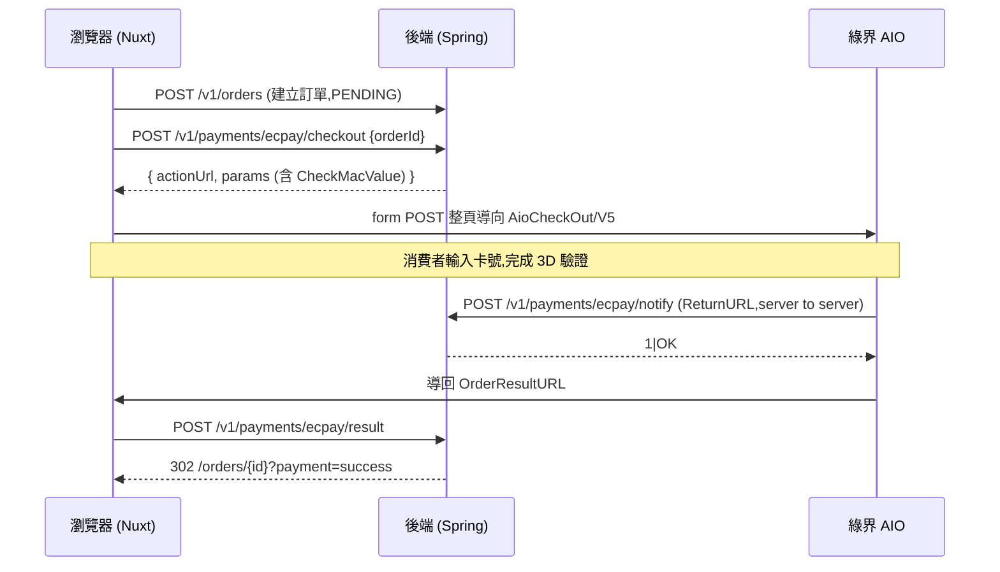

# 綠界 ECPay AIO 金流整合

> **分支**: `feat/ecpay-aio-payment`  
> **日期**: 2026-09-15  
> **範圍**: 綠界全方位金流 (AIO),僅開放**信用卡一次付清** (`ChoosePayment=Credit`),僅支援新台幣  
> **規格來源** (2026-09-15 取自 developers.ecpay.com.tw):
> [產生訂單 2862](https://developers.ecpay.com.tw/2862.md) /
> [付款結果通知 2878](https://developers.ecpay.com.tw/2878.md) /
> [信用卡一次付清 2866](https://developers.ecpay.com.tw/2866.md) /
> [介接注意事項 2858](https://developers.ecpay.com.tw/2858.md) /
> [檢查碼機制 2902](https://developers.ecpay.com.tw/2902.md)

## 目錄

1. [背景](#1-背景)
2. [付款流程](#2-付款流程)
3. [修改說明](#3-修改說明)
4. [API](#4-api)
5. [設計決策](#5-設計決策)
6. [測試步驟](#6-測試步驟)
7. [疑難排解](#7-疑難排解)
8. [已知限制與後續工作](#8-已知限制與後續工作)

---

## 1. 背景

整合前的狀態:

- `OrderService.createOrder` 建立的訂單停在 `PENDING` (待付款),庫存已扣,購物車已清,但**沒有任何付款流程**.
- `Payment` entity 與 `payments` 表存在,但從未被寫入.
- 購物車頁有"貨到付款 / 信用卡 / ATM"三個選項,後端卻完全沒有接收 `paymentMethod`.

整合後:消費者送出訂單即導向綠界付款頁,付款成功由綠界的 server callback 把訂單轉為 `PAID`.購物車頁只保留信用卡.

---

## 2. 付款流程



- **ReturnURL** (`/notify`):綠界 server 直接呼叫,是付款結果的**正式來源**,必須回純文字 `1|OK`,否則綠界每 5-15 分鐘重送,一天最多 4 次.
- **OrderResultURL** (`/result`):消費者瀏覽器被綠界頁面 POST 回來,處理後 302 導回前端訂單頁.
- **ClientBackURL**:消費者在綠界頁面按"返回商店"時導回訂單頁,不帶付款結果.
- ReturnURL 與 OrderResultURL **到達順序不固定**,兩者都帶 CheckMacValue,因此共用同一套冪等處理 (`PaymentService.handlePaymentResult`),誰先到都能正確轉 `PAID`.

---

## 3. 修改說明

### 3.1 後端

| 檔案 | 類型 | 說明 |
| :--- | :--- | :--- |
| `config/EcpayConfig.java` | 新增 | `@ConfigurationProperties(prefix = "ecpay")`,所有欄位 `@NotBlank`,缺值或空字串時啟動即失敗 |
| `util/EcpayCheckMacValue.java` | 新增 | CheckMacValue (SHA256) 產生與驗證,驗證用 `MessageDigest.isEqual` (timing-safe) |
| `service/PaymentService.java` | 新增 | 建立付款表單 (`createEcpayCheckout`),處理付款結果 (`handlePaymentResult`),決定導回網址 (`resultRedirectUrl`) |
| `controller/PaymentController.java` | 新增 | `/v1/payments/ecpay` 下的 `checkout` / `notify` / `result` 三個端點 |
| `dto/request/payment/EcpayCheckoutRequest.java` | 新增 | `{ orderId }` |
| `dto/response/payment/EcpayCheckoutResponse.java` | 新增 | `{ actionUrl, params }` |
| `enums/PaymentStatus.java` | 新增 | `UNPAID` / `SUCCESS` / `FAILED` |
| `entity/Payment.java` | 修改 | 新增 `merchantTradeNo`;`status` 由 String 改為 `PaymentStatus` enum |
| `repository/OrderRepository.java` | 修改 | 新增 `findByIdForUpdate` (`PESSIMISTIC_WRITE`,即 `SELECT ... FOR UPDATE`) |
| `config/SecurityConfig.java` | 修改 | `POST /v1/payments/ecpay/notify` 與 `/result` 設為 `permitAll` (改由 CheckMacValue 驗證身分) |
| `resources/application.yaml` | 修改 | 新增 `ecpay:` 設定區段 |

### 3.2 資料庫 migration

| 檔案 | 內容 |
| :--- | :--- |
| `V2__add_payment_merchant_trade_no.sql` | `payments` 新增 `merchant_trade_no varchar(20)` + unique key |
| `V3__payment_status_enum.sql` | `payments.status` 由 `varchar(255)` 改為 `enum('FAILED','SUCCESS','UNPAID')`,與 `orders` / `products` 的 status 欄位一致 |

> 原本打算在 V2 一次完成兩件事,但開發時 dev backend 的 devtools hot reload 已先套用了只含第一件事的 V2.
> 為避免 checksum mismatch 又不手動改 DB,V2 維持已套用的內容,enum 轉換另外放在 V3 (fix forward).
> `payments` 表在此之前沒有任何寫入路徑,轉換不會有既有資料問題.

### 3.3 前端

| 檔案 | 類型 | 說明 |
| :--- | :--- | :--- |
| `composables/useEcpayCheckout.ts` | 新增 | `redirectToEcpay(orderId)`:取得付款表單並以隱藏 form POST 整頁導向綠界.`onRestoreFromEcpay(cb)`:從綠界頁按上一頁時 (bfcache 還原) 重設畫面狀態 |
| `pages/cart.vue` | 修改 | 付款方式只留信用卡;不再送 `paymentMethod`;建單後直接導向綠界;第 4 步改為"前往付款"過渡畫面;導向失敗時提示並轉到訂單頁 |
| `pages/orders/[id].vue` | 修改 | `PENDING` 訂單顯示"前往付款"按鈕 (可重新付款);讀取 `?payment=success\|failed` 顯示提示後清掉 query |
| `pages/orders/index.vue` | 修改 | 讀取 `?payment=error` (付款結果無法驗證) 顯示提示 |

### 3.4 設定與部署

新增的環境變數 (`compose.yaml` 已轉傳給 backend):

| 變數 | 必填 | 說明 |
| :--- | :---: | :--- |
| `ECPAY_MERCHANT_ID` | ✅ | 特店編號,必須與 HashKey/HashIV 成對 |
| `ECPAY_HASH_KEY` | ✅ | 機密,不可進版控或前端 |
| `ECPAY_HASH_IV` | ✅ | 機密,不可進版控或前端 |
| `ECPAY_CHECKOUT_URL` | ✅ | stage:`https://payment-stage.ecpay.com.tw/Cashier/AioCheckOut/V5`,正式:`https://payment.ecpay.com.tw/Cashier/AioCheckOut/V5` |
| `ECPAY_CALLBACK_BASE_URL` | ✅ | 綠界 server 打得到的 API base,**含 `/api`**,只能是 80/443 埠,不可放在 CDN 後方 |
| `APP_FRONTEND_BASE_URL` | ✅ | 付款完成後導回的前端 origin |
| `ECPAY_TRADE_NO_PREFIX` | | MerchantTradeNo 前綴,預設 `SS` |

- `env/.env.dev.example` / `env/.env.staging.example` 填入綠界官方公開的 stage 測試帳號 (3002607),`env/.env.prod.example` 為 `CHANGE_ME`.
- compose 對未設定的變數會傳入**空字串**,yaml 預設值不會生效,因此 `EcpayConfig` 以 `@NotBlank` 在啟動時擋下.
- 改 env 後需重建 backend 容器才會生效:`./stack.sh dev up backend`.

---

## 4. API

### POST `/v1/payments/ecpay/checkout` - 建立綠界付款表單

需登入,只能為**自己的** `PENDING` 訂單付款.每次呼叫都會產生新的 `MerchantTradeNo`.

**Request Body**:

```json
{ "orderId": 3 }
```

**Response** `200 OK`:

```json
{
  "success": true,
  "message": "付款表單產生成功",
  "data": {
    "actionUrl": "https://payment-stage.ecpay.com.tw/Cashier/AioCheckOut/V5",
    "params": {
      "MerchantID": "3002607",
      "MerchantTradeNo": "SS3TMU2HJNO8",
      "MerchantTradeDate": "2026/09/15 17:44:13",
      "PaymentType": "aio",
      "TotalAmount": "1590",
      "TradeDesc": "shopsys order 3",
      "ItemName": "可攜式藍芽音響 x1",
      "ReturnURL": "https://tu-zhu.soay-fish.ts.net/api/v1/payments/ecpay/notify",
      "OrderResultURL": "https://tu-zhu.soay-fish.ts.net/api/v1/payments/ecpay/result",
      "ClientBackURL": "https://tu-zhu.soay-fish.ts.net:8443/orders/3",
      "ChoosePayment": "Credit",
      "EncryptType": "1",
      "CustomField1": "3",
      "CheckMacValue": "..."
    }
  }
}
```

前端必須把 `params` **原封不動**以 form POST 送到 `actionUrl`,改動任何值都會讓檢查碼不符.

| 狀態碼 | 情境 |
| :--- | :--- |
| `400` | 訂單不是 `PENDING`,或金額含小數 (綠界只收新台幣整數) |
| `401` | 未登入 |
| `403` | 為他人的訂單付款 |
| `404` | 使用者或訂單不存在 |
| `422` | `orderId` 未填 |

### POST `/v1/payments/ecpay/notify` - 付款結果通知 (ReturnURL)

公開端點,僅供綠界 server 呼叫.Form POST (`application/x-www-form-urlencoded`),綠界送 `Accept: text/html`.

| 情境 | 回應 |
| :--- | :--- |
| CheckMacValue 驗證通過 (包含金額不符,模擬付款等已記錄 log 的異常) | `200` `text/plain` `1\|OK` |
| CheckMacValue 驗證失敗 | `400` `text/plain` `0\|CheckMacValue Error` |
| 非預期錯誤 (例如 DB 暫時斷線) | `500` `text/plain` `0\|Error`,讓綠界稍後重送 |

### POST `/v1/payments/ecpay/result` - 付款結果導回 (OrderResultURL)

公開端點,消費者瀏覽器由綠界頁面 POST 過來.處理邏輯與 `/notify` 相同,回應一律為 `302`:

| 情境 | Location |
| :--- | :--- |
| 訂單已付款 | `{APP_FRONTEND_BASE_URL}/orders/{id}?payment=success` |
| 付款失敗,或驗證通過但內容異常 | `{APP_FRONTEND_BASE_URL}/orders/{id}?payment=failed` |
| 驗證失敗,找不到訂單,或非預期錯誤 | `{APP_FRONTEND_BASE_URL}/orders?payment=error` |

---

## 5. 設計決策

### 5.1 MerchantTradeNo 每次付款都重新產生

綠界的 `MerchantTradeNo` **永久唯一**,同一個編號不能送第二次.消費者放棄付款後重新付款,必須換一組新的.
而且 3002607 是所有開發者共用的測試帳號,只用訂單 id 很容易和別人撞號.

格式:`{prefix}{orderId}T{毫秒時間戳 base36 大寫}`,例如 `SS3TMU2HJNO8`,只含英數字,長度超過 20 時直接丟例外.
`payments.merchant_trade_no` 記錄最後一次 (或實際付款成功那次) 的編號,供對帳與日後的 `QueryTradeInfo` 查詢.

### 5.2 用 CustomField1 找回訂單

建立付款時把訂單 id 放在 `CustomField1`,callback 用它找訂單,**不依賴 MerchantTradeNo**.
情境:消費者開了兩個分頁各產生一次付款,在舊分頁付款成功,此時資料庫記錄的已經是新分頁的編號,用 MerchantTradeNo 會找不到.

### 5.3 付款結果處理 (`handlePaymentResult`)

依序檢查,任何一步不通過就停止:

| 順序 | 檢查 | 不通過時 |
| :---: | :--- | :--- |
| 1 | CheckMacValue (timing-safe) | `INVALID_SIGNATURE`,不信任任何欄位,`/notify` 回 400 |
| 2 | `MerchantID` 是自己的 | 記 log,忽略 |
| 3 | `CustomField1` 找得到訂單,並以 `SELECT ... FOR UPDATE` 上鎖 | 記 log,忽略 |
| 4 | `SimulatePaid` 不是 `1` | 記 log,忽略 (綠界後台模擬付款不會撥款,不可出貨) |
| 5 | `TradeAmt` 等於訂單金額 | 記 log,忽略 |
| 6 | `RtnCode` 等於字串 `"1"` | Payment 標為 `FAILED` (已 SUCCESS 則不覆蓋),訂單維持 `PENDING` 可重新付款 |

通過後依訂單狀態處理:

| 訂單狀態 | 處理 |
| :--- | :--- |
| `PENDING` | 訂單轉 `PAID`;Payment 轉 `SUCCESS`,寫入 `transactionId` (綠界 TradeNo),`paymentMethod` (綠界 PaymentType,如 `Credit_CreditCard`),`paidAt` |
| `PAID` 等已付款狀態,TradeNo 相同 | 重送或 notify/result 各到一次,直接視為成功 (冪等) |
| `PAID` 等已付款狀態,TradeNo 不同 | 重複付款,`log.warn` 標示需人工退款 |
| `CANCELLED` | `log.warn` 標示需人工退款,不改狀態 |

- 驗證失敗**不回** `1|OK` (介接注意事項規定驗證相符才能回);驗證通過但內容異常仍回 `1|OK`,避免綠界反覆重送.
- `RtnCode` 以字串比對:AIO callback 是 Form POST,收到的值是字串 `"1"`.
- `MerchantTradeDate` / `PaymentDate` 一律以 `Asia/Taipei` 處理.

### 5.4 送給綠界的欄位

- 選填參數不使用時**直接省略**,不送空字串 (空字串也會被納入 CheckMacValue).
- `ItemName` 為 `品名 x數量`,以 `#` 分隔多品項;品名會先移除 HTML 標籤,控制字元,`#`,以及綠界 CDN 會攔截的 `;` `|` `` ` ``,並截到 200 字元以內 (官方上限 400,被綠界截斷時會切壞多位元組字元,導致檢查碼不符).
- `TradeDesc` 固定為 `shopsys order {id}`,不帶特殊字元.

### 5.5 `/notify` 不可宣告 `produces`

綠界 server 送的是 `Accept: text/html`.若 mapping 宣告 `produces = text/plain`,Spring 會找不到 handler 而丟出 406,
錯誤轉到 `/error` 後又被 Spring Security 擋成 **401**,綠界永遠收不到 `1|OK`.
實際測試時就發生過這個問題 (當次靠 OrderResultURL 補上付款結果),修正為不宣告 `produces`,改在 `ResponseEntity` 直接指定 `Content-Type: text/plain`.
`PaymentControllerTest` 有對應的回歸測試.

---

## 6. 測試步驟

### 6.1 自動化測試

```bash
# 全部測試
./mvnw test

# 只跑金流相關
./mvnw test -Dtest="EcpayCheckMacValueTest,PaymentServiceTest,PaymentControllerTest"
```

| 測試類別 | 數量 | 涵蓋內容 |
| :--- | :---: | :--- |
| `util/EcpayCheckMacValueTest` | 9 | 綠界官方 test vectors (基本,`'`,`~`,空格,callback 驗證);key 順序無關;竄改金額,缺檢查碼,錯誤 HashKey 驗證失敗 |
| `service/PaymentServiceTest` | 15 | 付款表單參數與簽章;重新付款換新編號;ItemName 清理與截斷;他人訂單 403;非 PENDING;金額含小數;付款成功;重送冪等;竄改;MerchantID 不符;金額不符;模擬付款;授權失敗;已取消訂單;導回網址 |
| `controller/PaymentControllerTest` | 11 | checkout 需登入與參數驗證;notify 回精確的 `1\|OK` 純文字;**綠界 `Accept: text/html` 回歸測試**;驗證失敗 400;非預期錯誤 500;result 302 導向 |

### 6.2 環境準備 (dev)

**1. 確認 env**

`env/.env.dev` 需包含 (可從 `env/.env.dev.example` 複製 ECPay 區段):

```bash
ECPAY_MERCHANT_ID=3002607
ECPAY_HASH_KEY=pwFHCqoQZGmho4w6
ECPAY_HASH_IV=EkRm7iFT261dpevs
ECPAY_CHECKOUT_URL=https://payment-stage.ecpay.com.tw/Cashier/AioCheckOut/V5
ECPAY_CALLBACK_BASE_URL=https://tu-zhu.soay-fish.ts.net/api
APP_FRONTEND_BASE_URL=https://tu-zhu.soay-fish.ts.net:8443
```

**2. 重建 backend 並確認 migration**

```bash
./stack.sh dev up backend

docker exec shop-sys-dev-mariadb-1 sh -c 'mariadb -u"$MARIADB_USER" -p"$MARIADB_PASSWORD" "$MARIADB_DATABASE" \
  -e "SELECT version, description, success FROM flyway_schema_history; SHOW COLUMNS FROM payments;"'
```

預期 `flyway_schema_history` 有 V1,V2,V3 且 `success = 1`;`payments` 有 `merchant_trade_no` 欄位,`status` 為 `enum('FAILED','SUCCESS','UNPAID')`.

**3. 開啟 Tailscale Funnel (只公開付款回呼路徑)**

綠界只能打公開的 80/443 埠,tailnet 內的 `:8443` 連不進來.首次使用需要:

1. tailnet 允許 Funnel:第一次執行 `tailscale funnel` 時 CLI 會給一個 `https://login.tailscale.com/f/funnel?node=...` 連結,到管理後台同意即可.
2. (選擇性) 把自己設為 operator,之後就不必每次 sudo:`sudo tailscale set --operator=$USER`.

```bash
sudo tailscale funnel --bg --set-path=/api/v1/payments/ecpay \
    https+insecure://localhost:8443/api/v1/payments/ecpay
tailscale funnel status
```

預期輸出:

```
https://tu-zhu.soay-fish.ts.net (Funnel on)
|-- /api/v1/payments/ecpay proxy https+insecure://localhost:8443/api/v1/payments/ecpay
```

**4. 從公網確認打得到**

本機的 MagicDNS 會把網域解析到 tailnet IP,要用公開 DNS 的結果才是真的走公網:

```bash
PUB=$(dig +short @1.1.1.1 tu-zhu.soay-fish.ts.net | grep -E '^[0-9.]+$' | head -1)

# 付款回呼路徑:預期 HTTP 400 + "0|CheckMacValue Error" (代表綠界連得進來)
# 帶上 Accept: text/html 模擬綠界 server
curl -s --resolve tu-zhu.soay-fish.ts.net:443:$PUB -X POST \
  -H 'Accept: text/html' -d 'a=b' -w '\nHTTP %{http_code} %{content_type}\n' \
  https://tu-zhu.soay-fish.ts.net/api/v1/payments/ecpay/notify

# 其他路徑不應公開:預期 HTTP 404
curl -s --resolve tu-zhu.soay-fish.ts.net:443:$PUB -o /dev/null -w 'HTTP %{http_code}\n' \
  https://tu-zhu.soay-fish.ts.net/api/v1/products
```

### 6.3 瀏覽器端對端測試

| 步驟 | 操作 | 預期結果 |
| :---: | :--- | :--- |
| 1 | 開 `https://tu-zhu.soay-fish.ts.net:8443/login`,以 `test01@example.com` 登入 | 登入成功 |
| 2 | 開任一上架商品 (例如 `/products/6`),按"加入購物車" | 右上角購物車數量 +1 |
| 3 | 開 `/cart` | 步驟條第 4 步為"前往付款" |
| 4 | "下一步",填寫收件人姓名,電話,地址 | 進到付款資訊 |
| 5 | 付款方式確認只有"信用卡付款 (由綠界 ECPay 安全付款)"且已選取,按"送出訂單並前往付款" | 顯示"訂單已建立,正在前往付款頁..."後整頁導向 `payment-stage.ecpay.com.tw` |
| 6 | 綠界頁面確認訂單資訊 | 訂單編號為 `SS{訂單id}T...`,商品明細與金額正確 |
| 7 | 選"信用卡",填入測試資料 (見下表) 並送出 | 進入 3D 驗證頁 |
| 8 | 輸入 3D 驗證碼 `1234` | 綠界顯示付款成功並自動導回 |
| 9 | 回到 `/orders/{id}` | 右上角提示"付款成功",訂單狀態為"已付款","前往付款"按鈕消失,網址的 `?payment=success` 已被清掉 |

綠界 stage 測試資料 (環境不會真的驗證,格式正確即可):

| 欄位 | 值 |
| :--- | :--- |
| 信用卡號 | `4311-9522-2222-2222` |
| 有效期限 | 任意未來月/年 |
| 安全碼 | 任意三碼,例如 `222` |
| 持卡人姓名 | 任意英文,例如 `TEST USER` |
| 手機號碼 | 任意台灣手機格式,例如 `0912345678` (不會真的發簡訊) |
| Email | 任意格式正確的信箱 |
| 3D 驗證碼 | `1234` |

> 綠界測試頁在 `ChoosePayment=Credit` 下仍會顯示 Apple Pay,iPASS MONEY,街口支付,綠界Pay 等選項 (測試帳號設定).
> 後端只看 `RtnCode` 與金額,用這些方式付款同樣會轉為已付款,`payment_method` 會記錄實際的 `PaymentType`.

### 6.4 付款後的驗證

**1. DB**

```bash
docker exec shop-sys-dev-mariadb-1 sh -c 'mariadb -u"$MARIADB_USER" -p"$MARIADB_PASSWORD" "$MARIADB_DATABASE" -e "
  SELECT o.id, o.status, p.status AS pay, p.payment_method, p.merchant_trade_no, p.transaction_id, p.paid_at
  FROM orders o LEFT JOIN payments p ON p.order_id = o.id ORDER BY o.id DESC LIMIT 3;"'
```

預期:`orders.status = PAID`,`payments.status = SUCCESS`,`payment_method = Credit_CreditCard`,`transaction_id` 為綠界的 TradeNo,`paid_at` 有值.

**2. backend log**

```bash
docker logs --since 10m shop-sys-dev-backend-1 2>&1 | grep 綠界
```

預期只有**一行**"綠界付款成功,orderId=...,MerchantTradeNo=...,TradeNo=...".notify 與 result 中較晚到的那一個走冪等分支,不會再記一次.

**3. nginx access log (確認綠界 server 的 ReturnURL 真的成功)**

```bash
docker logs --since 10m shop-sys-dev-nginx-1 2>&1 | grep payments/ecpay
```

預期:

- 一筆 `POST /api/v1/payments/ecpay/notify 200`,User-Agent 為 `Mozilla/4.0 (compatible; MSIE ...` (綠界 server)
- 一筆 `POST /api/v1/payments/ecpay/result 302` (消費者瀏覽器)

**只看訂單頁顯示"已付款"不夠**:就算 notify 失敗,result 也會把訂單轉成已付款,但消費者付完款就關掉瀏覽器時,這筆付款會卡在待付款.一定要確認 notify 是 `200`.

### 6.5 其他情境

| 情境 | 操作 | 預期結果 |
| :--- | :--- | :--- |
| 放棄付款後重新付款 | 在綠界頁按"返回商店"或瀏覽器上一頁 | 回到 `/orders/{id}`,狀態為"待付款","前往付款"可再按;再次導向綠界時訂單編號是新的一組 |
| 導向失敗 | 例如暫時停掉 backend 再送出訂單 | 訂單已建立,提示"訂單已建立,但無法前往付款"並轉到訂單頁 |
| 付款結果無法驗證 | 直接 POST 一個亂填的表單到 `/api/v1/payments/ecpay/result` | 302 到 `/orders?payment=error`,訂單列表頁提示"無法確認付款結果" |
| 綠界後台模擬付款 | 綠界 stage 特店後台 (vendor-stage.ecpay.com.tw) 對訂單按"模擬付款" | 送出的 `SimulatePaid=1` 被忽略,訂單維持待付款,log 有"收到綠界模擬付款通知,不更新訂單" |

### 6.6 用模擬 callback 測試邊界情境

不必真的刷卡,就能測試簽章錯誤,授權失敗,重送等情境.下面的腳本以**獨立於 Java 的 Python 實作**計算 CheckMacValue,順便交叉驗證後端的演算法.
先在前台建立一筆待付款訂單,並從 DB 查到 `id` 與 `merchant_trade_no` (或呼叫 checkout 取得).

```python
# sim_callback.py <orderId> <MerchantTradeNo> <TradeAmt>
import hashlib, ssl, sys, urllib.parse, urllib.request

KEY, IV = "pwFHCqoQZGmho4w6", "EkRm7iFT261dpevs"
BASE = "https://tu-zhu.soay-fish.ts.net:8443/api/v1/payments/ecpay"

def cmv(params):
    items = sorted(((k, v) for k, v in params.items() if k != "CheckMacValue"), key=lambda kv: kv[0].lower())
    raw = "HashKey=%s&%s&HashIV=%s" % (KEY, "&".join(f"{k}={v}" for k, v in items), IV)
    enc = urllib.parse.quote_plus(raw, safe="").replace("~", "%7E").lower()
    for a, b in [("%2d", "-"), ("%5f", "_"), ("%2e", "."), ("%21", "!"), ("%2a", "*"), ("%28", "("), ("%29", ")")]:
        enc = enc.replace(a, b)
    return hashlib.sha256(enc.encode()).hexdigest().upper()

class NoRedirect(urllib.request.HTTPRedirectHandler):
    def redirect_request(self, *a, **k): return None

ctx = ssl.create_default_context(); ctx.check_hostname = False; ctx.verify_mode = ssl.CERT_NONE
opener = urllib.request.build_opener(urllib.request.HTTPSHandler(context=ctx), NoRedirect)

def post(path, params):
    req = urllib.request.Request(BASE + path, data=urllib.parse.urlencode(params).encode(),
                                 headers={"Content-Type": "application/x-www-form-urlencoded", "Accept": "text/html"})
    try:
        r = opener.open(req, timeout=15); return r.status, r.read().decode(), r.headers.get("Location")
    except urllib.error.HTTPError as e:
        return e.code, e.read().decode(), e.headers.get("Location")

order_id, merchant_trade_no, amount = sys.argv[1], sys.argv[2], sys.argv[3]

def callback(rtn_code, simulate="0"):
    p = {"MerchantID": "3002607", "MerchantTradeNo": merchant_trade_no, "StoreID": "", "RtnCode": rtn_code,
         "RtnMsg": "交易成功" if rtn_code == "1" else "授權失敗", "TradeNo": "2609150000000001", "TradeAmt": amount,
         "PaymentDate": "2026/09/15 12:05:00", "PaymentType": "Credit_CreditCard", "PaymentTypeChargeFee": "0",
         "TradeDate": "2026/09/15 12:00:00", "SimulatePaid": simulate,
         "CustomField1": order_id, "CustomField2": "", "CustomField3": "", "CustomField4": ""}
    p["CheckMacValue"] = cmv(p)
    return p

tampered = callback("1"); tampered["TradeAmt"] = "1"
print("竄改金額        ", post("/notify", tampered)[:2])
print("模擬付款        ", post("/notify", callback("1", simulate="1"))[:2])
print("授權失敗        ", post("/notify", callback("10100248"))[:2])
print("付款成功        ", post("/notify", callback("1"))[:2])
print("重送同一筆      ", post("/notify", callback("1"))[:2])
print("OrderResultURL  ", post("/result", callback("1"))[0::2])
```

預期輸出 (訂單最後會變成已付款,只用在測試訂單上):

```
竄改金額         (400, '0|CheckMacValue Error')
模擬付款         (200, '1|OK')          # 訂單不變,log: 收到綠界模擬付款通知
授權失敗         (200, '1|OK')          # payments.status = FAILED,訂單仍 PENDING
付款成功         (200, '1|OK')          # 訂單 PAID
重送同一筆       (200, '1|OK')          # 冪等,不會重複處理
OrderResultURL   (302, 'https://tu-zhu.soay-fish.ts.net:8443/orders/{id}?payment=success')
```

### 6.7 測試後清理

```bash
# 關閉 Funnel,讓付款回呼路徑不再對外公開
sudo tailscale funnel reset
tailscale funnel status   # 預期 No serve config
```

### 6.8 測試紀錄 (2026-09-15)

| 項目 | 結果 |
| :--- | :--- |
| 自動化測試 | `./mvnw test` 189 個全數通過 (新增 35 個) |
| CheckMacValue 與綠界相容 | 後端產生的表單送到綠界 stage,付款頁正確顯示訂單編號,品名,金額 |
| 模擬 callback (dev MariaDB) | 6.6 的各情境結果全部符合預期;Python 與 Java 兩份 CheckMacValue 實作結果一致 |
| 設定缺值 | `ECPAY_HASH_KEY` 為空字串時啟動失敗,訊息為 `ecpay.hashKey must not be blank` |
| 瀏覽器端對端 | 訂單 3 以測試卡付款成功,TradeNo `2609151744433337`,訂單頁顯示已付款 |
| 發現並修正的問題 | 17:46:50 綠界 ReturnURL 帶 `Accept: text/html`,`/notify` 當時宣告了 `produces = text/plain` 而回 401 (見 5.5),當次靠 OrderResultURL 補上付款結果 |
| 修正後的真實重送 | 17:55:08 綠界 server (`175.99.72.1`) 重送同一筆 ReturnURL,回應 `200 1\|OK`,後端走冪等分支,沒有重複處理 |

---

## 7. 疑難排解

| 症狀 | 可能原因 | 處理 |
| :--- | :--- | :--- |
| backend 啟動失敗:`ecpay.xxx must not be blank` | env 缺少 ECPAY 變數,或 compose 傳入空字串 | 補齊 `env/.env.*` 後 `./stack.sh dev up backend` |
| backend 啟動失敗:`Migration checksum mismatch` | 已套用的 `V{n}__*.sql` 被修改 | 還原該檔案,改動另寫新的 `V{n+1}__*.sql` |
| 綠界付款頁顯示 CheckMacValue 錯誤 | HashKey/HashIV 與 MerchantID 不成對;或前端改動了 `params` | 確認 env 三個值是同一組;前端必須原封不動送出 |
| 付款成功但訂單仍是待付款 | 綠界打不到 ReturnURL,且瀏覽器沒有回到 OrderResultURL | 依 6.2 第 4 點從公網測試;查 nginx log 是否有綠界的 `/notify` 請求 |
| nginx log 中綠界的 `/notify` 是 401 或 406 | `/notify` 被加上 `produces` 或其他內容協商限制 | 見 5.5,`PaymentControllerTest` 的 `Accept: text/html` 測試應該會失敗 |
| nginx log 中綠界的 `/notify` 是 400 | CheckMacValue 驗證失敗 | 查 backend log"CheckMacValue 驗證失敗";確認 HashKey/HashIV |
| 綠界完全沒有打 `/notify` | ReturnURL 不是公開的 443/80,或 Funnel 沒開 | `tailscale funnel status`;確認 `ECPAY_CALLBACK_BASE_URL` 沒有帶 `:8443` |
| log 出現"需人工退款" | 重複付款,或已取消的訂單收到付款 | 到綠界特店後台人工退款 |
| log 出現"收到綠界模擬付款通知" | 在綠界特店後台按了模擬付款 | 預期行為,完整流程請用測試卡 |

---

## 8. 已知限制與後續工作

- **未付款訂單會一直佔著庫存**:庫存在建單時就扣除,需要排程把逾時未付款的訂單取消並回補庫存.
- **退款**:尚未串接 `CreditDetail/DoAction`,重複付款與已取消訂單的退款目前只能到綠界後台人工處理.
- **漏收 callback 的補查**:尚未用 `QueryTradeInfo` 排程查詢長時間停在 `UNPAID` 的付款.
- **商品價格允許小數**:綠界只收整數,目前在付款時才擋,應在商品價格驗證時就限制.
- **Funnel 只能給一個環境**:dev 與 staging 共用同一個 443 路徑,同一時間只有 Funnel 指向的環境收得到回呼.
- **上線前**:換成正式特店帳號與正式端點 (`payment.ecpay.com.tw`),`ECPAY_CALLBACK_BASE_URL` 必須是正式網域的 443,並依綠界[介接注意事項](https://developers.ecpay.com.tw/2858.md)逐項確認 (TLS 1.2,主機時間校正,防火牆允許 `postgate.ecpay.com.tw` 連入等).
